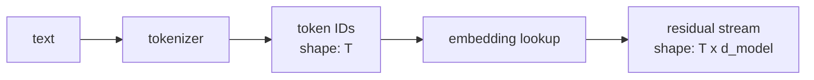
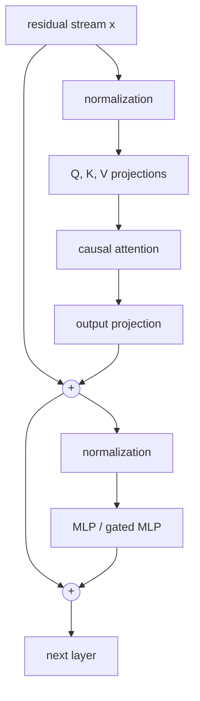
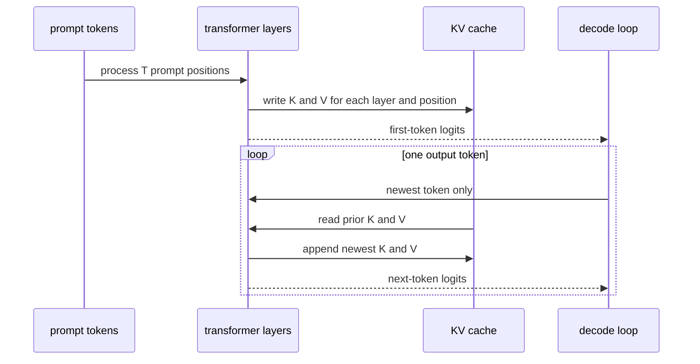
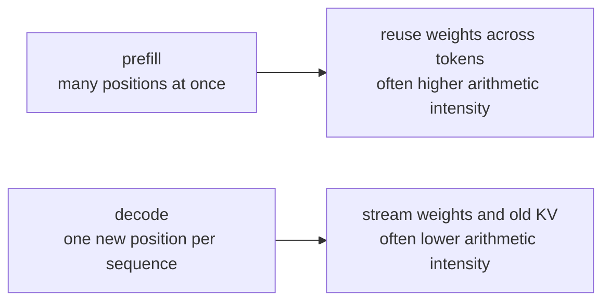
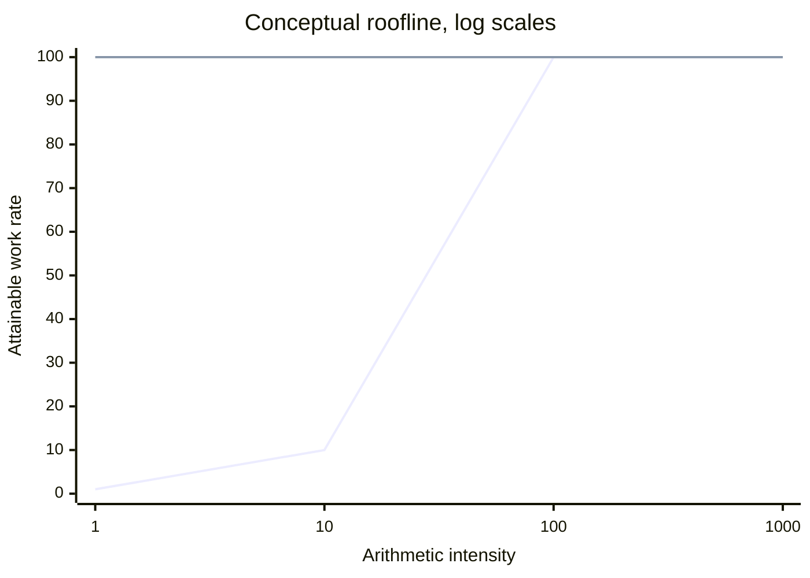
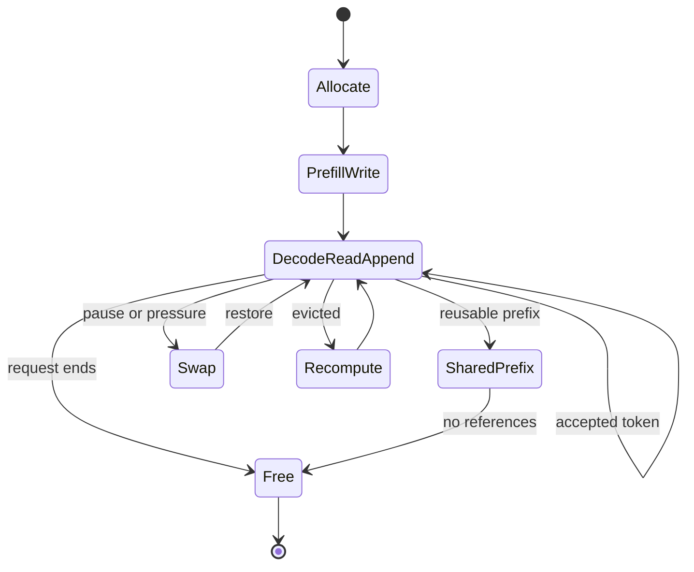

# Transformer inference from first principles

## The question

Why can one trained model create two different hardware workloads?

A transformer first reads a prompt. It then emits tokens one at a time. The same weights do both jobs. The amount of useful work per byte moved can differ sharply.

This chapter derives that claim. It does not yet prove that separate chips are best.

## 1. Text becomes token IDs

### Fact

A tokenizer maps text into a sequence of integers from a fixed vocabulary. Token boundaries need not match words. The model sees token IDs, not text.

Suppose:

```text
"KV cache"
      |
      v
[token 41, token 9132]
```

The exact IDs depend on the tokenizer.

### Fact

An embedding table maps each token ID to a vector of width `d_model`. Position information is then added or applied inside attention. Current decoder-only models often use rotary position embeddings, but the exact method is an architecture choice.



### Mental model

Treat the residual stream as a shared scratchpad with one vector per token position. Each layer reads it and writes an update back to it.

Limit: the model does not store a human-readable proposition in one fixed slot. Features are distributed across dimensions and positions.

## 2. One decoder layer

A common decoder-only transformer layer has two main sublayers:

1. Causal self-attention moves information between token positions.
2. An MLP transforms each token position independently.

Residual connections add each sublayer's output back to the stream. Normalization controls scale.



Architectures differ in normalization placement, activation, bias use, position method, mixture-of-experts routing, and head layout. The dataflow above is a useful base case.

## 3. Attention creates the KV cache

For one layer, start with hidden states `X`:

```text
Q = X Wq
K = X Wk
V = X Wv

Attention(Q, K, V) = softmax(Q K^T / sqrt(d_head) + causal_mask) V
```

The causal mask blocks a token from reading later positions.

### Fact

During autoregressive generation, old keys and values do not change. The system can store them and compute only the new token's key and value. That stored state is the KV cache.

It stores keys and values for:

- every active sequence,
- every processed token position,
- every transformer layer,
- every KV head.

It does not store queries because an old query is not needed to compute attention for a new token.



### KV-cache shape

For one sequence, a simple shape is:

```text
K: [layers, tokens, kv_heads, head_dim]
V: [layers, tokens, kv_heads, head_dim]
```

Implementations may reorder, shard, quantize, or page these dimensions.

The byte count is:

```text
KV bytes =
    2
  * layers
  * tokens
  * kv_heads
  * head_dim
  * bytes_per_element
```

The leading `2` means key plus value.

### Worked example

Use a model with:

```text
layers            = 32
KV heads          = 8
head dimension    = 128
cache data type   = BF16 = 2 bytes
context           = 8,192 tokens
```

Per token:

```text
2 * 32 * 8 * 128 * 2
= 131,072 bytes
= 128 KiB
```

At 8,192 tokens:

```text
128 KiB * 8,192
= 1 GiB per sequence
```

With 32 live sequences at that length, the logical KV cache is 32 GiB before allocator metadata and workspace.

### Fact

Multi-head attention uses one K and V head for each query head. Multi-query attention shares one K and V head across query heads. Grouped-query attention uses an intermediate number. Reducing `kv_heads` reduces cache size and KV traffic in direct proportion, if all other terms stay fixed. Ainslie et al. introduced grouped-query attention as this middle point [S3].

### Question

What exactly persists when an agent invocation pauses?

At least four policies are possible:

- Keep device-resident KV state.
- Move KV state to host memory or storage.
- Discard it and recompute from tokens.
- Keep only shared prefix blocks and recompute the private suffix.

The best choice depends on pause length, context length, reuse probability, memory pressure, transfer bandwidth, and recompute cost.

## 4. Prefill and decode

### Prefill

Prefill processes all prompt tokens. Matrix multiplications can expose a large token dimension:

```text
[T x d_model] @ [d_model x d_out]
```

Each weight can contribute to many token positions after one load through the memory hierarchy.

Prefill also writes the initial KV cache.

### Decode

Decode processes one new position per sequence per step:

```text
[B x d_model] @ [d_model x d_out]
```

`B` is the active batch. At low batch size, the system may move many weight bytes for little matrix work. Attention also reads prior K and V across the growing context.

### Fact with a boundary

Researchers often describe prefill as compute-bound and decode as memory-bandwidth-bound. Splitwise measured distinct compute, memory, latency, and power behavior across the two phases [S6]. DistServe and related systems use the same distinction [S7].

This description is conditional. Very short prefills, long-context attention, small models, large decode batches, mixture-of-experts routing, quantization, and kernel quality can move either phase to another bottleneck.

### Mental model



Do not turn "often" into "always."

## 5. Arithmetic intensity and the roofline

Arithmetic intensity is:

```text
operations / bytes moved from the limiting memory level
```

A simple roofline bound is:

```text
attainable operations per second <=
min(
    peak compute,
    memory bandwidth * arithmetic intensity
)
```

The ridge point is:

```text
peak compute / memory bandwidth
```

Below that intensity, bandwidth caps performance. Above it, compute caps performance.



The diagram shows the relation only. It does not plot a specific processor.

### Toy decode bound

Assume an 8-billion-parameter dense model with 16-bit weights:

```text
weight bytes = 8 billion * 2 bytes = 16 GB
```

If a low-batch decode step must fetch roughly 16 GB from HBM, an H100 SXM's stated 3.35 TB/s bandwidth gives this impossible-to-beat transfer time:

```text
16 GB / 3,350 GB/s = 0.00478 s = 4.78 ms
```

This is about 209 tokens/s for one sequence before KV traffic, synchronization, kernel overhead, and incomplete bandwidth use. It is a lower bound, not a prediction. NVIDIA states 3.35 TB/s for H100 SXM [S11].

Batching changes the denominator:

```text
same weight read / more useful token rows
```

This raises arithmetic intensity and throughput. It can also raise queueing delay.

## 6. Latency and throughput are different objectives

Useful service metrics include:

- Time to first token, or TTFT. Prefill and queueing often dominate it.
- Time per output token, or TPOT. Decode cadence dominates it.
- End-to-end latency.
- Tokens per second across the server.
- Goodput. Requests or tokens that meet a stated service-level objective.

### Fact

Continuous batching lets the scheduler change the batch between decode iterations. PagedAttention manages dynamically growing KV state in non-contiguous blocks and enables cache sharing [S4].

### Counterargument to fixed specialization

Workload mix changes over time. A fixed pool of prefill chips can queue while decode chips sit partly idle, or the reverse. Transfer of KV state adds another latency and bandwidth term. Newer work compares aggregation, disaggregation, and hybrid scheduling rather than treating one layout as universal [S12].

## 7. The KV lifecycle



### Fact

The cache grows by one position for each accepted autoregressive token. Paged allocation reduces fragmentation. Prefix caching can share blocks when requests have an identical reusable prefix. Speculative methods may create temporary branch state, then keep only accepted paths.

### Hypothesis

Ephemeral agent invocations create a cache-placement problem that differs from ordinary chat serving. Tool waits and orchestration pauses create uncertain reuse times. A scheduler could compare:

```text
keep cost
vs.
swap out + swap in cost
vs.
recompute cost
```

### Experiment

For a real trace, log:

```text
prompt tokens
generated tokens before pause
pause duration
resume probability
shared-prefix length
KV bytes
host/device transfer time
recompute time
```

Then test cache policies against TTFT, TPOT, energy, and device-memory occupancy.

## 8. Quantization and memory hierarchy

Quantization stores weights or KV values with fewer bits. It can:

- fit a larger model or batch in a fixed memory,
- reduce traffic,
- add conversion or scaling work,
- change model quality,
- shift the bottleneck.

The useful hierarchy is:

```text
registers / on-chip SRAM
        |
        v
HBM or other package memory
        |
        v
host DRAM
        |
        v
local storage or remote cache
```

Capacity rises as we move down. Bandwidth usually falls and latency rises.

### Mental model

Moving a bit can cost more energy than the arithmetic that consumes it. The exact ratio depends on process, voltage, wire length, memory type, and access pattern. Use measured platform data when making a hardware claim.

### Question about low voltage

Lower voltage can reduce dynamic switching energy, roughly following:

```text
dynamic energy proportional to capacitance * voltage^2
```

But lower voltage can reduce frequency and noise margin. Leakage, SRAM stability, interconnect, memory I/O, and cooling remain. Low voltage is a design variable. It is not yet the center of the thesis.

## 9. What may remain true across architectures

These are candidate invariants, not laws:

- A useful system must move model parameters or a compressed equivalent near compute.
- Generation carries state from prior work, even if that state is not a transformer KV cache.
- Parallel work and sequential dependency place different demands on hardware.
- Data movement, capacity, and interconnect can limit performance or energy.
- Scheduling determines whether theoretical hardware gains survive real traffic.

Architectures can break the current form:

| Architecture or method | What changes | What state remains |
|---|---|---|
| GQA or MQA | Fewer KV heads | A smaller attention cache |
| Speculative decoding | Verifies several candidates in one target-model pass | Accepted target-model KV plus temporary branch state |
| Medusa | Adds heads that propose later tokens | Target-model KV remains; verification accepts a branch [S8] |
| Masked diffusion language model | Refines many masked positions with bidirectional attention | No standard append-only causal KV cache for the whole generation path [S9] |
| State-space or recurrent model | Updates a fixed-size recurrent state instead of attending to all old KV pairs | Per-layer recurrent state [S10] |
| Hybrid attention and recurrence | Uses both mechanisms | Both cache types, with architecture-specific sizes |

### Important correction

"Future language models will always need KV cache" is too strong.

A safer claim is:

> Useful inference will carry some state or recompute prior information. Its size, update rule, and hardware cost depend on the architecture.

## 10. First view of Nat's hardware hypothesis

### Hypothesis

Separate prefill and decode systems may lower power or cost because:

- Prefill can use high matrix throughput.
- Decode can value memory capacity, bandwidth, low-latency scheduling, and efficient low-batch execution.
- Each pool can use a different power envelope.

Splitwise supplies direct evidence that phase-specific machine selection can help on studied models and workloads [S6].

### Counterarguments

- KV transfer can dominate short requests or weak interconnects.
- A heterogeneous fixed ratio can waste capacity under changing traffic.
- Large decode batches make decode more compute-efficient.
- Quantization and better kernels can move the bottleneck.
- Speculative decoding turns some sequential decode work into wider verification work.
- Diffusion or recurrent architectures can change or remove append-only KV traffic.
- Manufacturing two chips loses scale and flexibility.
- A configurable chip or shared package may capture most of the gain.

### Current thesis status

Plausible and testable. Established system results support phase separation. They do not establish a universal two-chip architecture.

## Check yourself

Answer these from memory:

1. Why cache K and V, but not Q?
2. Derive KV bytes from layers, tokens, KV heads, head dimension, and data type.
3. Why can batching improve decode throughput while hurting latency?
4. What does arithmetic intensity measure?
5. Why is "prefill is compute-bound, decode is bandwidth-bound" conditional?
6. What must cross the interconnect in a disaggregated prefill/decode system?
7. How does GQA change the KV-cache equation?
8. Why does speculative decoding weaken the simple one-token-at-a-time hardware model?
9. Why might a diffusion language model lack an append-only causal KV cache?
10. What evidence would make the separate-chip thesis false?

## Next lesson

Build a spreadsheet or script that computes, for several model shapes:

- model weight bytes,
- KV bytes per token and request,
- minimum weight-read time,
- minimum KV-transfer time between prefill and decode,
- the break-even pause time for keep, swap, and recompute.

Then plot each workload on a roofline for one real device.

## Sources cited

Citation keys refer to [sources.md](sources.md).
