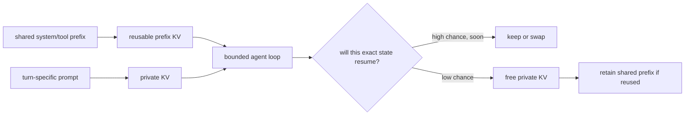

# A quantitative test of phase specialization

## The claims under test

These claims came from Nat. Each remains a hypothesis until a measurement or cited result supports it.

| ID | Hypothesis | What would test it |
|---|---|---|
| H1 | Future inference may favor distinct prefill and autoregressive-decode chips or pools. | Compare equal-cost systems across real traffic and service goals. |
| H2 | Decode hardware may favor large near-package memory and high bandwidth. | Measure capacity, bytes per accepted token, bandwidth use, and joules per accepted token. |
| H3 | Prefill can build KV state and stream it to decode hardware, so the link becomes a first-order term. | Compare KV transfer time with prefill, queueing, and decode time. |
| H4 | An agent loop may discard private turn KV while keeping reusable system and tool prefixes. | Trace prefix reuse, pause time, and private-state resume rate. |
| H5 | Many concurrent agent invocations may use compute that interactive single-user traffic leaves idle. | Sweep concurrency while holding total work and latency goals fixed. |
| H6 | Intent throughput may help at the workload level. | Define intent boundaries and report it beside lower-level metrics. |
| H7 | Speculation and diffusion may change the phase balance. | Measure accepted tokens per target pass, full-sequence refinement work, and cache traffic. |

## 1. Fix the model and conventions

This worksheet uses Meta Llama 3.1 8B as a named example. Meta states that the model has 8 billion parameters, a 128K context window, and grouped-query attention [S13]. The released configuration uses:

```text
layers              32
hidden width         4,096
query heads          32
KV heads             8
head dimension       128
MLP intermediate     14,336
```

We use BF16 weights and BF16 KV values. Each element takes 2 bytes.

### Counting rules

This worksheet uses these estimates:

```text
weight bytes = parameter count * bytes per weight

KV bytes =
2 * layers * tokens * KV heads * head dimension * bytes per KV element

dense linear FLOPs per token ~= 2 * parameter count

attention matmul FLOPs per decode token ~=
4 * layers * tokens * hidden width
```

The last expression counts the query-key dot products and the weighted-value operation. It excludes softmax, normalization, activation, sampling, and system overhead. FLOP conventions differ across tools. State the convention when comparing results.

### Derived constants

```text
weight bytes = 8B * 2 = 16 GB

KV bytes per token =
2 * 32 * 8 * 128 * 2
= 131,072 bytes
= 128 KiB

dense linear work per generated token ~= 16 GFLOPs

attention work per generated token ~=
524,288 * context_tokens FLOPs
```

## 2. KV and compute grow differently

| Context | KV per sequence | Weight bytes | Linear work per decode token | Attention matmul work | Estimated total |
|---:|---:|---:|---:|---:|---:|
| 8,192 | 1 GiB | 16 GB | 16.00 GFLOPs | 4.29 GFLOPs | 20.29 GFLOPs |
| 32,768 | 4 GiB | 16 GB | 16.00 GFLOPs | 17.18 GFLOPs | 33.18 GFLOPs |
| 131,072 | 16 GiB | 16 GB | 16.00 GFLOPs | 68.72 GFLOPs | 84.72 GFLOPs |

### Result

At 8K context and batch 1, model weights are much larger than one sequence's KV state. At 128K, BF16 weights and one sequence's BF16 KV state are similar in size.

This directly tests the claim that decode "rereads large KV/model state." Both terms matter. Which one dominates depends on context and batch.

### Counterargument

The model does not necessarily fetch every weight or KV byte from HBM once in the simple way this table assumes. Cache residency, tensor parallelism, fused kernels, paged layouts, KV quantization, sparsity, and attention partitioning change physical traffic.

## 3. Batch changes arithmetic intensity

Use this lower-detail byte model for one decode step:

```text
step bytes ~= weight bytes + batch * KV bytes per sequence

step FLOPs ~= batch * estimated FLOPs per sequence

arithmetic intensity ~= step FLOPs / step bytes
```

| Context | Batch | Total bytes per step | Bytes per sequence | Arithmetic intensity |
|---:|---:|---:|---:|---:|
| 8K | 1 | 17.07 GB | 17.07 GB | 1.19 FLOP/byte |
| 8K | 8 | 24.59 GB | 3.07 GB | 6.60 FLOP/byte |
| 8K | 64 | 84.72 GB | 1.32 GB | 15.33 FLOP/byte |
| 32K | 1 | 20.29 GB | 20.29 GB | 1.63 FLOP/byte |
| 32K | 8 | 50.36 GB | 6.29 GB | 5.27 FLOP/byte |
| 32K | 64 | 290.88 GB | 4.54 GB | 7.30 FLOP/byte |
| 128K | 1 | 33.18 GB | 33.18 GB | 2.55 FLOP/byte |
| 128K | 8 | 153.44 GB | 19.18 GB | 4.42 FLOP/byte |
| 128K | 64 | 1,115.51 GB | 17.43 GB | 4.86 FLOP/byte |

The 128K, batch-64 row needs more than a terabyte of logical step state under this simple model. It will not fit on one 80 GB H100. It is a scaling thought experiment, not a proposed single-device run.

### Result

Batch amortizes the weight read. Long context makes KV traffic dominate that benefit. Decode still performs meaningful compute, especially long-context attention. A bandwidth-first decode design still needs enough matrix and attention compute to consume its memory feed.

### Test for H5

Concurrency can raise batch and weight reuse. It can also:

- consume KV capacity,
- lengthen queues,
- mix requests with different context lengths,
- miss an interactive TPOT goal.

Report the throughput curve and its latency curve. A high batch is useful only inside the service goal.

## 4. KV transfer is a real phase boundary

NVIDIA Dynamo documents the disaggregated flow directly: a prefill worker builds KV state, transfers it, and a decode worker continues the request [S14]. Its current design can use NVLink, InfiniBand, or another NIXL transport.

The ideal transfer bound is:

```text
transfer time >= KV bytes / usable one-way link bandwidth
```

Use three illustrative peak link rates:

```text
50 GB/s    400 Gb/s fabric after converting bits to bytes
64 GB/s    PCIe Gen5 x16, one direction
900 GB/s   stated H100 SXM NVLink interconnect figure
```

These are ceilings. Protocol, topology, contention, software, and copy placement reduce usable bandwidth.

| Context | KV payload | 50 GB/s | 64 GB/s | 900 GB/s |
|---:|---:|---:|---:|---:|
| 8K | 1 GiB | 21.47 ms | 16.78 ms | 1.19 ms |
| 32K | 4 GiB | 85.90 ms | 67.11 ms | 4.77 ms |
| 128K | 16 GiB | 343.60 ms | 268.44 ms | 19.09 ms |

### Result

H3 is supported as a design concern. It is not yet supported as a universal bottleneck. The link is first-order when its transfer time is comparable to the saved compute, interference, or queueing time.

### Counterargument: recompute may win

Sending KV is not free. A decode worker could recompute the prompt locally instead.

Compare:

```text
remote path =
prefill queue
+ remote prefill
+ KV transfer
+ decode queue

local path =
decode queue
+ local prefill or chunked prefill
```

Streaming KV can cost more than recompute for short prompts, fast local prefill, slow links, or congested links. Conditional routing can choose per request.

## 5. Capacity claims need a bill of materials

H2 should not stop at "more on-chip memory." For this 8B example:

| Item | BF16 size |
|---|---:|
| Weights | 16 GB |
| One 8K sequence KV | 1 GiB |
| One 32K sequence KV | 4 GiB |
| One 128K sequence KV | 16 GiB |
| 32 sequences at 8K | 32 GiB |
| 32 sequences at 32K | 128 GiB |

Large SRAM on the compute die is unlikely to hold these totals. The practical question is often how much SRAM, package memory, and pooled memory the system can supply at a given bandwidth, latency, power, yield, and cost.

### Questions for a proposed decode chip

- How many weight bytes fit near compute?
- How many live sequences fit after weights and workspace?
- What is sustained random or paged KV bandwidth?
- What is sustained weight bandwidth at the chosen precision?
- Which memory tier owns inactive agent state?
- What link carries KV from prefill?
- How does capacity scale across chips?
- What compute rate keeps the memory system busy?

## 6. Energy implications

Energy needs measurement. Bytes and TDP alone do not give joules.

Still, they expose useful bounds. If an H100 SXM could stream 16 GB at its stated 3.35 TB/s peak, the transfer floor is 4.78 ms [S11]. Multiplying by the 700 W TDP gives 3.35 J for that interval:

```text
700 W * 0.00478 s = 3.35 J
```

This is a power-envelope scenario. It is not measured energy for a token. TDP is not instantaneous application power, peak bandwidth is not sustained bandwidth, and other work overlaps the transfer.

At batch 64, the same weight-stream interval spreads across 64 sequences:

```text
3.35 J / 64 = 0.052 J per sequence
```

KV traffic and compute add energy. Longer execution at lower power may also use more energy than shorter execution at higher power.

### Measurement rule

For hardware comparisons, report:

```text
joules per accepted token
joules per completed request
joules per completed intent
average and tail latency
quality or acceptance rate
```

Measure wall power when possible. Device telemetry alone misses host, memory, network, and cooling power.

## 7. Agent KV lifecycle

H4 proposes two kinds of state:



### Counterargument

Dropping private KV makes the next turn prefill the missing tokens again. The policy wins only when saved memory value exceeds expected replay and transfer cost.

### Required trace

For each invocation, record:

```text
human intent ID
agent-created task ID
request ID
sequence ID
shared-prefix token count
private token count
pause duration
whether the exact state resumes
accepted output tokens
tool wait time
```

Then simulate keep, swap, compress, shared-prefix-only, and discard policies.

## 8. Define intent throughput carefully

Intent throughput can connect infrastructure work to completed user work. It can also hide amplification.

Keep these counters separate:

| Unit | Definition |
|---|---|
| Human-originated intent | A goal submitted by a person. One intent can span turns. |
| Agent-created task | A delegated unit created while pursuing an intent. |
| Model request | One call into a model endpoint. |
| Concurrent sequence | One live generation sequence occupying scheduler and KV state. |
| Input token | One token processed during prefill or replay. |
| Accepted output token | One token kept after ordinary or speculative generation. |
| Completed intent | A human-originated intent that meets a named success test. |

Suggested metrics:

```text
completed intents / hour
joules / completed intent
requests / completed intent
agent tasks / completed intent
tokens / completed intent
P50 and P95 intent latency
success rate under a fixed evaluator
```

Do not compare intent throughput across systems unless the intent set, success test, quality bar, and tool environment match.

## 9. Methods that move the boundary

### Speculative decoding and Medusa

A draft model or extra heads propose several tokens. The target model verifies candidates in a wider pass. Accepted tokens reduce the number of sequential target passes.

This can:

- raise target-pass arithmetic intensity,
- add draft compute,
- add temporary candidate state,
- waste work on rejected candidates.

The right unit becomes accepted tokens per target pass and joules per accepted token.

### Diffusion language models

A masked diffusion model refines several positions across repeated full or partial sequence passes. It does not inherit the standard append-only causal KV path. That can raise parallel work while adding repeated refinement compute.

Recent preprints propose approximate cache reuse for diffusion models [S18]. This shows that "diffusion has no cache" is also too simple. The cache has a different validity rule.

## 10. Current architecture frontier

This map is dated 2026-07-25. It describes published systems and announced products. It does not predict winners.

| Layer | Example | What it tests |
|---|---|---|
| Memory management | vLLM PagedAttention [S4] | Page and share growing KV state. |
| Co-located scheduling | Sarathi-Serve [S5] | Mix chunked prefill with decode to limit interference. |
| Academic phase split | Splitwise [S6], DistServe [S7] | Run prefill and decode on separate workers or pools. |
| KV-centered disaggregation | Mooncake [S15] | Use a distributed KV store and separate cache resources from compute. |
| Paused workflows | InferCept [S16] | Keep, discard, or swap state around inference interruptions. |
| Commercial serving software | NVIDIA Dynamo [S14] | Route across prefill and decode pools and transfer KV through NIXL. |
| Announced context hardware | NVIDIA Rubin CPX [S17] | Specialize hardware for long-context processing and prefill. |
| Announced decode partition | NVIDIA Groq 3 LPX integration [S19] | Split decode attention and latency-sensitive FFN work across engines. |
| Multi-token target verification | Medusa [S8] and speculative decoding | Trade serial target passes for proposals and wider verification. |
| Masked diffusion | LLaDA [S9] and cache research [S18] | Replace strict left-to-right generation with iterative refinement. |
| Recurrent state | Mamba [S10] | Replace context-growing KV with fixed-size layer state. |

Vendor specifications and performance claims need independent measurement. Announced products may change before release.

## 11. What we can say now

### Supported

- Prefill and decode can create different compute and memory behavior.
- Current software can split the phases and move KV between worker pools.
- The KV payload reaches gigabytes for one long sequence in this named 8B model.
- Batch changes weight amortization and arithmetic intensity.
- Long context raises both KV traffic and decode attention compute.

### Still open

- Whether separate custom chips beat flexible chips or heterogeneous pools.
- Whether low voltage produces a system energy win.
- Whether agent traffic has enough stable prefix reuse and bounded private state.
- Whether intent throughput can be measured without hiding task amplification.
- Which generation architecture dominates future workloads.

## Conversation checks

Nat should be able to answer:

1. At what context does this model's BF16 KV state equal its BF16 weight size?
2. Why can weights dominate at batch 1 while KV dominates at high concurrency?
3. What must cross the link after remote prefill?
4. When can local recompute beat KV transfer?
5. Why does decode still need compute?
6. Why is "on-chip memory" too vague for this workload?
7. Which counters prevent intent throughput from hiding agent amplification?
8. How do speculation and diffusion change accepted work per sequential step?

Citation keys refer to [sources.md](sources.md).
