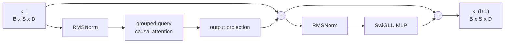
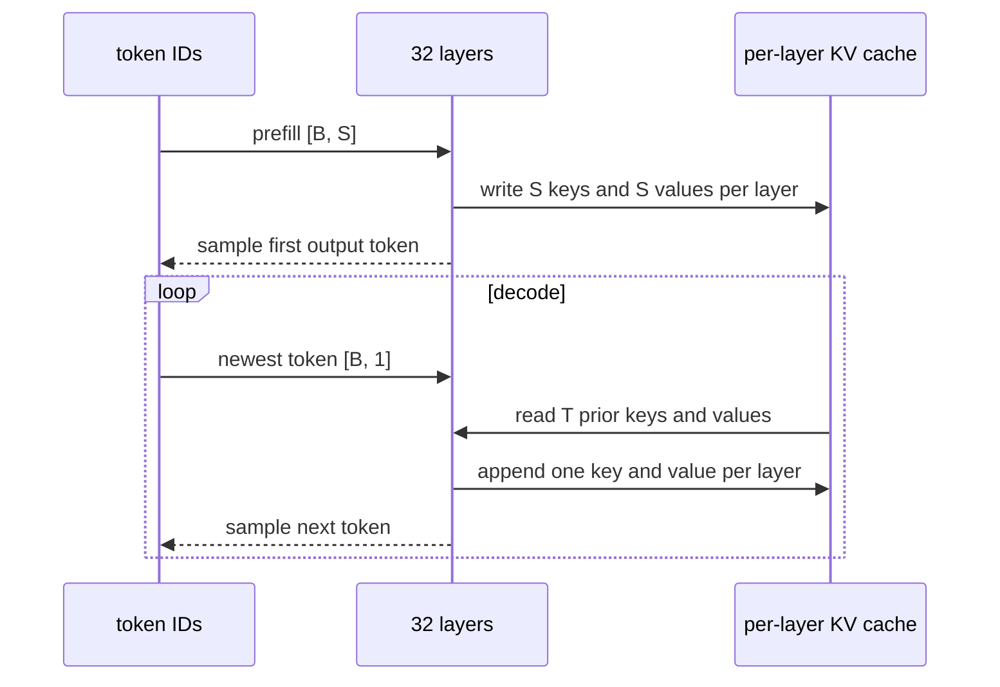

# One token through Llama

This chapter builds the standard decoder-only transformer before testing hardware ideas. The running large model is Llama 3.1 8B. A tiny two-layer model keeps the arithmetic small enough to check by hand.

## 1. Name every axis

Use these symbols:

| Symbol | Meaning |
|---|---|
| `B` | sequences in the current batch |
| `S` | token positions processed in this forward pass |
| `T` | prior cached positions |
| `D` | residual-stream width |
| `Hq` | query heads |
| `Hkv` | key and value heads |
| `Dh` | width of one head |
| `F` | MLP intermediate width |
| `L` | transformer layers |
| `V` | vocabulary size |

For Llama 3.1 8B:

```text
D = 4,096       Hq = 32
Hkv = 8         Dh = 128
F = 14,336      L = 32
V = 128,256
```

`D = Hq * Dh`. Grouped-query attention lets `Hkv` be smaller than `Hq`.

## 2. Tokenization and embedding

The tokenizer turns text into token IDs:

```text
tokens: [B, S] integer IDs
```

The embedding table has shape:

```text
E: [V, D]
```

An indexed lookup creates:

```text
x0 = E[tokens]
x0: [B, S, D]
```

This tensor starts the residual stream. A decoder layer preserves this outer shape.

### What embedding is not

Embedding lookup is not a matrix multiplication over the whole vocabulary. It gathers `B * S` rows. The final language-model head later scores the vocabulary.

## 3. One pre-normalized decoder layer

Llama uses RMSNorm before attention and before the MLP. Let `x_l` enter layer `l`.

```text
a_l = x_l + Attention(RMSNorm(x_l))
x_(l+1) = a_l + MLP(RMSNorm(a_l))
```

Both residual additions require the sublayer result to have shape `[B, S, D]`.



The residual stream is the main state passed between layers for the positions in the current forward pass. It is different from the KV cache, which preserves attention state across forward passes.

## 4. RMSNorm

For one `D`-element token vector `x`:

```text
rms(x) = sqrt((1 / D) * sum_i(x_i^2) + epsilon)

RMSNorm(x)_i = g_i * x_i / rms(x)
```

`g` is a learned vector of shape `[D]`. RMSNorm scales each token vector independently. It does not subtract the mean. Zhang and Sennrich introduced RMSNorm [S20].

### Shape

```text
input:  [B, S, D]
g:      [D]
output: [B, S, D]
```

### Tiny check

If `x = [1, -1, 1, -1]`, `g = [1, 1, 1, 1]`, and epsilon is ignored:

```text
rms(x) = sqrt((1 + 1 + 1 + 1) / 4) = 1
RMSNorm(x) = x
```

## 5. Q, K, and V projections

After normalization:

```text
q = x Wq
k = x Wk
v = x Wv
```

The weights and outputs are:

| Item | Weight shape | Output before head reshape |
|---|---:|---:|
| Q | `[D, Hq * Dh]` | `[B, S, Hq * Dh]` |
| K | `[D, Hkv * Dh]` | `[B, S, Hkv * Dh]` |
| V | `[D, Hkv * Dh]` | `[B, S, Hkv * Dh]` |

After reshape:

```text
q: [B, S, Hq,  Dh]
k: [B, S, Hkv, Dh]
v: [B, S, Hkv, Dh]
```

For Llama 3.1 8B:

```text
Wq: [4,096, 4,096]
Wk: [4,096, 1,024]
Wv: [4,096, 1,024]
```

Grouped-query attention cuts K and V projection width and cache size by four relative to 32 KV heads.

## 6. RoPE

RoPE rotates pairs of Q and K coordinates by an angle tied to token position [S21].

For one pair `(z0, z1)` at position `p` and frequency `theta`:

```text
[z0']   [ cos(p theta)  -sin(p theta) ] [z0]
[z1'] = [ sin(p theta)   cos(p theta) ] [z1]
```

Apply this to each coordinate pair in each query and key head.

```text
q_rope: [B, S, Hq, Dh]
k_rope: [B, S, Hkv, Dh]
```

Values are not rotated. RoPE changes attention scores through rotated Q and K. It does not add a position vector to the residual stream.

## 7. Grouped-query attention

With `Hq = 32` and `Hkv = 8`, four query heads share one K/V head:

```text
query heads 0..3   -> KV head 0
query heads 4..7   -> KV head 1
...
query heads 28..31 -> KV head 7
```

Conceptually repeat each K/V head across its query group. Efficient kernels need not materialize the repeats.

For query head `h`, let `group(h)` select its KV head.

```text
scores[b, h, i, j] =
dot(q[b, i, h, :], k[b, j, group(h), :]) / sqrt(Dh)
```

## 8. Causal mask, softmax, and value aggregation

During a full prefill with `S` positions:

```text
scores: [B, Hq, S, S]
```

The causal mask sets `scores[..., i, j]` to negative infinity when `j > i`. Token `i` cannot read a future token.

Normalize over source position `j`:

```text
p[b, h, i, :] = softmax(scores[b, h, i, :])
```

Aggregate values:

```text
head_out[b, h, i, :] =
sum_j p[b, h, i, j] * v[b, j, group(h), :]
```

```text
head_out: [B, Hq, S, Dh]
```

Transpose and join the heads:

```text
joined: [B, S, Hq * Dh] = [B, S, D]
```

The output projection mixes query-head results:

```text
attention_out = joined Wo
Wo: [D, D]
attention_out: [B, S, D]
```

Add it to the incoming residual stream.

### Implementation boundary

An efficient attention kernel need not store the full `[S, S]` score or probability matrices in HBM. FlashAttention tiles the calculation to reduce memory traffic while computing exact attention [S2].

## 9. The SwiGLU MLP

After the second RMSNorm:

```text
gate = x Wgate
up   = x Wup
hidden = SiLU(gate) elementwise_multiply up
mlp_out = hidden Wdown
```

Shapes:

```text
Wgate: [D, F]
Wup:   [D, F]
Wdown: [F, D]

gate, up, hidden: [B, S, F]
mlp_out:          [B, S, D]
```

SiLU is:

```text
SiLU(z) = z * sigmoid(z)
```

The elementwise gate lets one projection control another. Shazeer studied this SwiGLU form [S22].

Add `mlp_out` to the residual stream. The layer is complete.

## 10. Final norm, logits, and sampling

After `L` layers:

```text
y = RMSNorm(x_L)
logits = y W_vocab
```

```text
y:       [B, S, D]
W_vocab: [D, V]
logits:  [B, S, V]
```

For generation, only the last current position's logits choose the next token:

```text
next_logits: [B, V]
```

Sampling can apply temperature, top-k, top-p, repetition rules, or greedy argmax. These policies operate on logits or probabilities. They are outside the transformer layers.

The selected token ID becomes the next decode input.

## 11. Training and inference

### Training

Training processes many positions and predicts the next token at each position:

```text
input:  [t0, t1, t2, t3]
target: [t1, t2, t3, t4]
```

A causal mask prevents leakage. The loss compares logits against targets. Backpropagation retains or recomputes activations and calculates gradients for weights. Optimizer state also consumes memory.

### Inference

Inference does not need gradients or optimizer state. It has two phases:

- Prefill processes prompt positions and creates KV state.
- Decode processes one new token per active sequence, reads old KV, and appends new K/V.

Training activation memory and inference KV memory solve different problems.

## 12. Exact KV-cache contents

For each layer, cache the RoPE-applied keys and the values:

```text
K_cache[l]: [B, T, Hkv, Dh]
V_cache[l]: [B, T, Hkv, Dh]
```

Across all layers:

```text
K_cache: [L, B, T, Hkv, Dh]
V_cache: [L, B, T, Hkv, Dh]
```

Real systems often page, shard, or reorder these axes.

The cache does not contain:

- Q from old positions,
- attention probabilities,
- MLP hidden activations,
- the residual stream for old positions,
- logits,
- model weights.

Tokens or request metadata are stored elsewhere so the system can reconstruct and manage the sequence.

### Why K receives RoPE before caching

Old keys keep the rotation for their absolute positions. A new query receives the rotation for its new position. Their dot product then includes relative-position structure. Reapplying RoPE to every old key on every step would waste work.

## 13. Prefill and decode shapes

Suppose a request has a four-token prompt.

### Prefill

```text
input IDs:       [1, 4]
residual stream: [1, 4, D]
Q:               [1, 4, Hq, Dh]
new K and V:     [1, 4, Hkv, Dh]
attention:       each prompt position reads allowed prompt positions
cache after:     [L, 1, 4, Hkv, Dh] for K and V
```

### First decode step

Feed the selected token:

```text
input IDs:       [1, 1]
residual stream: [1, 1, D]
Q:               [1, 1, Hq, Dh]
new K and V:     [1, 1, Hkv, Dh]
attention:       new Q reads 4 old K/V positions plus the new position
cache after:     [L, 1, 5, Hkv, Dh]
```



## 14. Tiny transformer by hand

Use:

```text
V = 16       D = 8
L = 2        Hq = 2
Hkv = 1      Dh = 4
F = 24       BF16 = 2 bytes
```

### Parameter shapes

Per layer:

| Weights | Elements |
|---|---:|
| Q `[8, 8]` | 64 |
| K `[8, 4]` | 32 |
| V `[8, 4]` | 32 |
| O `[8, 8]` | 64 |
| gate `[8, 24]` | 192 |
| up `[8, 24]` | 192 |
| down `[24, 8]` | 192 |
| two RMS scales `[8]` | 16 |
| Total per layer | 784 |

Whole model with untied embedding and output head:

```text
embedding       16 * 8 = 128
two layers      2 * 784 = 1,568
final RMS scale 8
output head     8 * 16 = 128
total           1,832 parameters
BF16 weights    3,664 bytes
```

Biases are omitted, as in Llama linear layers.

### KV bytes

Per cached token:

```text
2 * L * Hkv * Dh * 2 bytes
= 2 * 2 * 1 * 4 * 2
= 32 bytes
```

A four-token prompt uses `128 bytes` of logical KV state.

### One attention score

Let one rotated query and its shared key be:

```text
q = [1, 0, 1, 0]
k = [1, 1, 0, 0]
Dh = 4
```

Then:

```text
dot(q, k) = 1
scaled score = 1 / sqrt(4) = 0.5
```

If two allowed positions have scaled scores `[0.5, 0]`:

```text
softmax([0.5, 0]) ~= [0.6225, 0.3775]
```

For scalar example values `[2, 6]`, the weighted result is:

```text
0.6225 * 2 + 0.3775 * 6 = 3.51
```

Real values are four-element vectors and the same probabilities weight each coordinate.

## 15. Llama-scale traffic and work

### Weight traffic

Eight billion BF16 parameters occupy about 16 GB. A batch-1 decode pass can approach a weight-streaming workload because each matrix sees only one row. Caches and fusion reduce some physical traffic, but the model is much larger than on-chip SRAM.

### KV traffic

Llama 3.1 8B BF16 KV per token:

```text
2 * 32 * 8 * 128 * 2 = 131,072 bytes = 128 KiB
```

At 8K context, one sequence holds 1 GiB of logical KV. Each decode step reads prior KV for attention and writes 128 KiB for the accepted token.

### Linear FLOPs

A matrix multiply uses about two FLOPs per weight element for one token row:

```text
linear FLOPs per token ~= 2 * parameter count ~= 16 GFLOPs
```

This is a model-level estimate. It includes the vocabulary head only to the degree that it is included in the parameter count and executed by the implementation.

### Decode attention FLOPs

QK scores and value aggregation cost about:

```text
4 * L * T * D
```

At `T = 8,192`:

```text
4 * 32 * 8,192 * 4,096
= 4.29 GFLOPs
```

Total coarse work is about `20.29 GFLOPs` per sequence for that step.

### Arithmetic intensity

For a batch-1, 8K step with 16 GB of weights and about 1 GiB of prior KV:

```text
intensity ~= 20.29 GFLOPs / 17.07 GB
~= 1.19 FLOP/byte
```

This low value explains why bandwidth is often the first decode concern. It does not prove that compute is unimportant.

## 16. Activation memory

### Inference

A simple residual tensor for BF16 Llama 3.1 8B is:

```text
B * S * 4,096 * 2 bytes
```

For `B=1`, `S=8,192`, that is 64 MiB. Kernels create temporary Q/K/V, MLP, attention, and communication buffers. Efficient kernels reuse or tile storage.

Decode uses `S=1` for the new residual path, while KV remains proportional to total context `T`.

### Training

Training needs activations from many layers for backward, unless it recomputes them. Its activation memory can scale with `L * B * S * D` plus MLP and attention intermediates. This is why training memory cannot be inferred from inference KV size.

## 17. Batching and continuous batching

A static batch groups requests for the whole run. Generation lengths differ, so completed sequences leave empty work.

Continuous batching changes the active set between decode iterations:

```mermaid
gantt
    title Continuous batch across decode iterations
    dateFormat X
    axisFormat %s
    section request A
    decode :0, 5
    section request B
    decode :0, 2
    section request C
    decode :2, 6
```



The scheduler can insert request C after B finishes.

Benefits:

- more weight reuse across sequence rows,
- fewer idle batch slots,
- higher server throughput.

Costs:

- more live KV state,
- scheduling and paging work,
- possible TPOT or queueing increases,
- mixed sequence lengths in attention.

## 18. Derive first, test hardware second

The baseline now supports these careful statements:

- Prefill exposes many token rows to large matrix multiplications.
- Low-batch decode exposes few rows and repeatedly uses a large model.
- Decode attention reads context-growing KV and performs context-growing compute.
- GQA reduces KV size without removing KV.
- Batching amortizes weights while multiplying live sequence state.
- A hardware claim must name model shape, context, batch, precision, and service goal.

Diffusion, speculation, Medusa, recurrent models, and custom phase chips belong in the comparison chapters. They should be compared against this derived baseline.

## Self-test

Answer without looking:

1. Why does every decoder layer return `[B, S, D]`?
2. Which axis does RMSNorm normalize?
3. Why are Llama's K and V projections narrower than Q?
4. Which tensors receive RoPE?
5. Which axis does attention softmax normalize?
6. What exact tensors enter the KV cache?
7. Why are old queries absent from the cache?
8. What changes from `S=prompt length` in prefill to `S=1` in decode?
9. Why can FlashAttention avoid materializing `[S, S]` without approximating attention?
10. Why does continuous batching help weight reuse and hurt KV capacity?

## Interactive gap finder

Take these one at a time. Stop at the first answer that feels vague.

1. Given `[B, S, D]`, write the Q, K, and V shapes for `Hq=32`, `Hkv=8`, and `Dh=128`.
2. Draw one query head and identify the KV head it shares.
3. For a three-token prefill, write the allowed source positions for each destination position.
4. Explain RoPE without using the phrase "adds position."
5. Derive the 128 KiB KV-per-token figure.
6. Name every byte term in a batch-1 decode step.
7. Explain why weight traffic per sequence falls with batch.
8. Explain why KV traffic per sequence does not fall the same way.
9. Separate training activations from inference KV state.
10. State one workload where separate prefill and decode hardware would likely lose.

The first uncertain answer is the next concept to study.

## Sources cited

Citation keys refer to [sources.md](sources.md).
