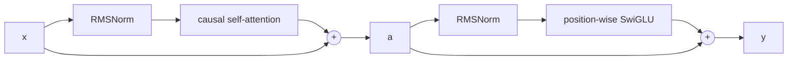
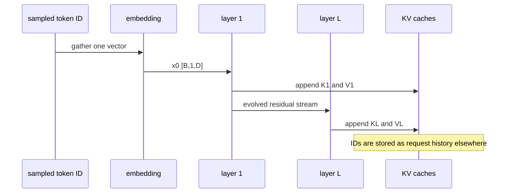

# Correcting the forward-pass mental model

This chapter responds to Nat's current model point by point. It keeps what is right and repairs what is missing.

## The corrected pass in one view


The sampled token ID is an input to the next forward pass. The KV cache receives K and V activations created inside every layer during that pass.

## 1. History: attention, encoder-decoder, and decoder-only models

### Nat's model

Attention likely predates encoder-decoder. Current language models are decoder-only. An encoder-decoder compressed text and then decoded it.

### Correction

Encoder-decoder sequence models came first. Early systems encoded the source sequence into a fixed-length vector and decoded from it. Bahdanau, Cho, and Bengio added learned attention to avoid forcing the entire source into one fixed vector [S24].

So:

- encoder-decoder predates neural attention,
- attention predates the Transformer,
- the original Transformer was an encoder-decoder architecture [S1],
- GPT-style causal language models use a decoder-only Transformer stack [S26].

Modern encoder-decoder Transformers do not usually compress the entire source into one vector. The encoder emits one contextual vector per source position. Each decoder layer can cross-attend to that sequence.

Llama is decoder-only. It has causal self-attention and no separate encoder or cross-attention path.

## 2. "Pipe here encoding" is likely byte-pair encoding

### Nat's model

Text is chunked, mapped to vocabulary IDs or numbers, then fed into layers.

### Correction

This is close. The missing distinction is between IDs and vectors.

A BPE-family tokenizer builds text tokens from learned subword pieces [S25]. Llama 3.1 uses a TikToken-based tokenizer [S13]. Tokenization produces integers:

```text
token IDs: [B, S]
```

The model cannot apply attention to integer IDs directly. An embedding table gathers a learned vector for each ID:

```text
embedding table E: [V, D]
x = E[token IDs]: [B, S, D]
```

Token ID `42` is an address into the embedding table. It is not a magnitude, and it does not mean "more" than token ID `41`.

## 3. A Llama block starts with normalization before attention

### Nat's model

Each layer starts with attention.

### Correction

At the sublayer level, attention comes first. Llama uses a pre-normalized block:

```text
a = x + Attention(RMSNorm(x))
y = a + MLP(RMSNorm(a))
```

The layer receives and returns `[B, S, D]`.



## 4. Q, K, and V have different jobs

### Nat's model

Q and V are familiar. K is missing. Queries may multiply values directly.

### Correction

All three come from learned projections of the normalized residual stream:

```text
Q = X Wq
K = X Wk
V = X Wv
```

Their roles are:

- Q asks what each destination position seeks.
- K provides an address-like match vector for each source position.
- V provides the content to mix after matching.

Q does not choose content by multiplying V directly.

First Q scores K:

```text
S = Q K^T / sqrt(Dh)
```

Then the causal mask removes future positions:

```text
S_masked[i, j] = -infinity when j > i
```

Then each row becomes probabilities over allowed source positions:

```text
A = softmax(S_masked, over source position j)
```

Finally those probabilities mix V:

```text
O = A V
```

The shortest correct memory aid is:

```text
Q matches K. The match weights mix V.
```

## 5. Shapes expose the math

For ordinary multi-head attention:

```text
Q: [B, H, S_query, Dh]
K: [B, H, S_key,   Dh]
V: [B, H, S_key,   Dh]
```

Matrix multiplication over `Dh` gives:

```text
Q K^T: [B, H, S_query, S_key]
A V:   [B, H, S_query, Dh]
```

For Llama grouped-query attention:

```text
Q: [B, S_query, 32, 128]
K: [B, S_key,    8, 128]
V: [B, S_key,    8, 128]
```

Four query heads share one K/V head. The conceptual score shape is still:

```text
[B, 32, S_query, S_key]
```

During one-token decode:

```text
S_query = 1
S_key = prior context T + current token
```

## 6. Tiny numerical attention example

Use one head with `Dh = 2`. We are computing the output for the second token, so both source positions are allowed.

```text
q  = [1, 0]
k1 = [1, 0]      v1 = [2, 0]
k2 = [0, 1]      v2 = [0, 4]
```

### Step 1: Q matches K

```text
raw scores = [q dot k1, q dot k2]
           = [1, 0]
```

Scale by `sqrt(2)`:

```text
scaled scores = [0.7071, 0]
```

### Step 2: row softmax

```text
A = softmax([0.7071, 0])
  ~= [0.6698, 0.3302]
```

### Step 3: weighted sum of V

```text
O = 0.6698 * [2, 0] + 0.3302 * [0, 4]
  = [1.3396, 1.3208]
```

Q and K produced two scalar weights. Those weights mixed the two value vectors.

If this were the first token, the causal mask would block `k2` and `v2`. Its attention weights would be `[1, 0]`.

## 7. Multi-head attention and output projection

### Nat's model

Multiple heads compute separate versions. A fully connected projection merges them.

### Correction

This is right.

Each query head produces `[B, S, Dh]`. Concatenate all query heads:

```text
heads:  [B, S, Hq, Dh]
joined: [B, S, Hq * Dh] = [B, S, D]
```

Then:

```text
attention_output = joined Wo
Wo: [D, D]
```

`Wo` mixes information across the concatenated head features and returns width `D`.

## 8. The MLP does not merge heads

### Nat's model

A feed-forward or fully connected stage follows attention.

### Correction

That is right, with one important boundary. The attention output projection already merged heads. The MLP acts independently at each token position.

For position `i`:

```text
gate_i = x_i Wgate
up_i = x_i Wup
hidden_i = SiLU(gate_i) elementwise_multiply up_i
mlp_i = hidden_i Wdown
```

No MLP operation moves information from token position `i` to position `j`. Attention performs the cross-position mixing.

Shapes:

```text
[B, S, D] -> [B, S, F] -> [B, S, D]
```

## 9. Residuals evolve one stream

### Nat's model

Residual additions may add the original vector `n` times.

### Correction

Each sublayer adds an update to the current stream:

```text
x1 = x0 + attention_update_0
x2 = x1 + mlp_update_0
x3 = x2 + attention_update_1
x4 = x3 + mlp_update_1
```

Expand two steps:

```text
x2 = x0 + attention_update_0 + mlp_update_0
```

The original signal has an additive path through the network. The implementation does not fetch `x0` and add a fresh copy at every layer. Later updates depend on the already evolved stream, so they are not independent terms.

Use this memory aid:

```text
x <- x + sublayer(norm(x))
```

## 10. Logits and sampling

### Nat's model

The final output becomes a token distribution sampled using temperature.

### Correction

Nearly right. The model first creates logits:

```text
h = final_RMSNorm(x)
logits = h W_vocab
logits: [B, S, V]
```

For next-token generation, use the final position:

```text
next_logits: [B, V]
```

Temperature rescales logits before softmax:

```text
p_i = softmax(logits_i / temperature)
```

Low temperature sharpens the distribution. High temperature flattens it. Greedy decoding takes the largest logit and needs no random sample. Top-k and top-p can restrict candidates before sampling.

## 11. The sampled ID does not enter the KV cache

### Nat's model

The sampled token is passed into the KV cache.

### Correction

The sampled token ID enters the next model step:

```text
sampled ID
-> embedding lookup
-> all decoder layers
```

Inside every layer, that token's current hidden vector creates:

```text
q_l = x_l Wq_l
k_l = x_l Wk_l
v_l = x_l Wv_l
```

That layer appends `k_l` and `v_l` to its own cache. Q is used immediately and discarded after the step.



Exact per-layer append shape in Llama 3.1 8B:

```text
new K_l: [B, 1, 8, 128]
new V_l: [B, 1, 8, 128]
```

Across 32 layers in BF16, one accepted token adds:

```text
2 * 32 * 8 * 128 * 2 bytes = 128 KiB
```

## Annotated reconstruction

Say this aloud and fill in the equations:

1. Text becomes ______ through the tokenizer.
2. An ______ table turns each ID into a `D`-wide vector.
3. A decoder block computes `a = x + ______(RMSNorm(x))`.
4. It then computes `y = a + ______(RMSNorm(a))`.
5. Attention projects `Q = ______`, `K = ______`, and `V = ______`.
6. Scores are `______ / sqrt(Dh)`.
7. A ______ blocks future source positions.
8. Row ______ turns scores into weights.
9. The weights multiply ______, not Q.
10. Head outputs are concatenated and multiplied by ______.
11. The final norm and ______ produce vocabulary logits.
12. The sampled ID is ______ and run through all layers on the next step.
13. Each layer appends the new token's ______ and ______ to its cache.

## Short verification

Answer these without notes:

1. Which came first: encoder-decoder models, neural attention, or the Transformer?
2. What is the difference between a token ID and an embedding?
3. Why does attention need K if it already has Q and V?
4. Write the four operations from Q/K/V to attention output.
5. Which dimension does row softmax normalize?
6. Which operation merges heads?
7. Why is the MLP called position-wise?
8. Does each layer add another copy of the initial embedding?
9. What creates logits, and how does temperature affect them?
10. Trace a sampled token ID until its K and V reach layer 17's cache.

If questions 3, 4, or 10 are uncertain, revisit attention before studying hardware.

## Sources cited

Citation keys refer to [sources.md](sources.md).
