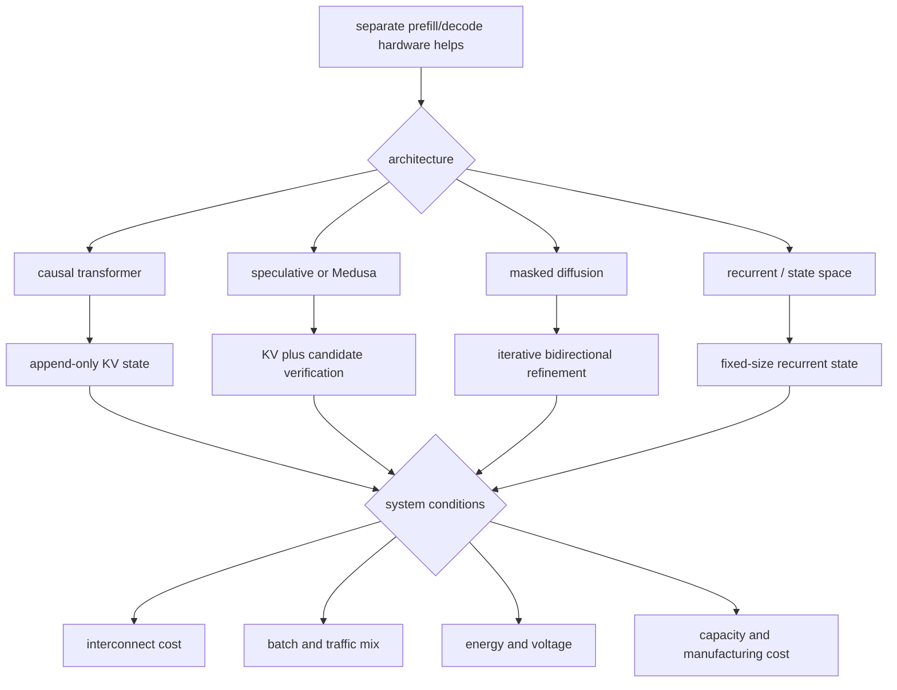

# Thesis map

## Nat's claim

Power and memory budgets may favor separate prefill and autoregressive-decode chips or systems.

Related hypotheses:

- Decode may favor large near-package capacity and bandwidth.
- The prefill-to-decode link may become a first-order cost.
- Agent loops may keep reusable prefix KV and discard most private turn KV.
- High agent concurrency may improve utilization within latency and capacity limits.
- Intent throughput may connect hardware work to completed goals if its units stay explicit.

## What is established

- A causal transformer can reuse old keys and values during decode.
- KV capacity grows with context, layers, KV heads, head width, precision, and active sequences.
- Prefill and decode often have different arithmetic intensity and latency behavior.
- Existing systems have split the phases across machines and measured gains on specific workloads.
- The split adds KV transfer, scheduling, and pool-balance costs.
- Weight traffic can exceed KV traffic at short context or low batch.
- Long-context decode adds meaningful attention compute.

## What remains a hypothesis

- Two chip designs beat two pools of general accelerators.
- Lower-voltage decode hardware yields a system-level energy win.
- Agent pause and resume patterns make durable KV storage a first-order design target.
- Most private agent KV can be dropped without costly replay.
- The workload stays transformer-like long enough to repay custom hardware cost.

## Branches that change the claim

## Evidence that would strengthen the claim

- Stable production traces show phase ratios that fit separate pools.
- KV transfer stays small relative to saved compute and queueing time.
- Decode energy falls on bandwidth-focused hardware at the same TPOT and quality.
- The result holds across context lengths, batch sizes, precisions, and model families.

## Evidence that would weaken it

- Hybrid scheduling matches the gain on one flexible accelerator.
- KV transfer or queueing dominates end-to-end latency.
- Local recompute costs less than moving remote KV.
- Speculation raises decode arithmetic intensity enough to use prefill hardware well.
- recurrent or diffusion models win and need a different state path.
- Memory packaging, rather than compute design, explains most of the gain.

## Working conclusion

Study phase specialization as a system design space. Do not assume the answer is two chips. Compare:

- one shared pool,
- one chip with phase-specific modes,
- separate pools of the same chip,
- heterogeneous existing chips,
- a shared package with different compute tiles,
- two custom chips.
