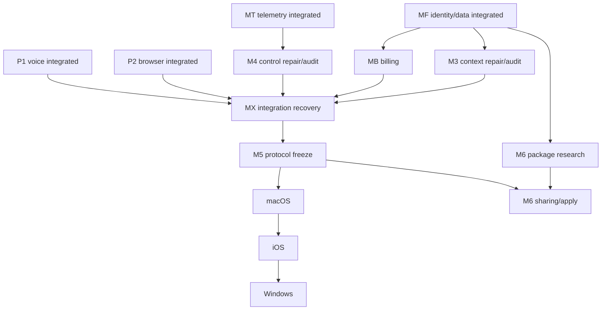

# Intent execution map

Date: 2026-07-10

This is the durable compiler from the user's product intents into independently
managed systems. It complements `portfolio-managers.md`; it does not authorize
feature code, paid services, real charges, signing, or active promotion.

## Confidence vocabulary

- **Measured:** an exact command or runtime exercise was actually run and its
  environment and outcome are recorded.
- **Architecture confidence:** a target justified by explicit invariants,
  constraints, tests and canaries. It is not a benchmark score.
- **Unknown:** evidence requiring paid providers, physical devices, production
  traffic, vendor accounts, signing credentials, legal policy, or an isolated
  deployment that has not run.

No paid benchmark, external model evaluation, payment-provider trial, native
device matrix, or observability-vendor trial was run to create this map.

## User intent registry

| Intent | Materialized program | State/dependency | Parallelism |
|---|---|---|---|
| reliable end-to-end voice, TTS failure diagnosis and visible fallback | P1 voice reliability + MT telemetry | integrated foundation; live-provider/device evidence remains unknown | runtime audits may run beside later programs |
| spoken voice/language/persona changes and immediate sampling | P1 voice contracts and sampler | integrated; paid/live voice quality is not measured | runtime QA is independent of billing/native research |
| bounded browser page customization inspired by prior tools | P2 browser customization | integrated artifact; active reload not proven | regression audit continues beside other programs |
| mobile/browser agent tools with proposal/approval/receipt | existing Android/browser/gateway contracts + M5 protocol | M5 protocol must freeze before new native clients | protocol research parallel; clients serial after freeze |
| fast context across sessions without opening history UI | M3 durable context | after MF identity; repair/audit currently required | independent from M4 implementation, serial before MX |
| speak-to-change-code with autonomous preview, rollback and deploy | M4 control plane | after MF+MT; repair/audit currently required | independent from M3, serial before MX/promotion |
| self-hostable but splittable voice and deployment services | M4 + MX operations | logical boundaries now; physical split only with evidence | topology research parallel; migration serial/staged |
| frontend/backend/database/telemetry/observability completeness | MF + MT + MX responsibility matrix | foundations integrated; every later manager maps impacts | cross-cutting audit, not six arbitrary services |
| payments, budgets and entitlements | MB billing | after MF; business/provider decisions unresolved | domain/sandbox research now; real provider work blocked |
| macOS notch/companion, iPhone island and Windows taskbar agents | M5 protocol/native | protocol -> macOS -> iOS -> Windows | OS research parallel; implementation/evidence serial |
| configurable animated companions and sharing | M6 companion catalog | package research now; sharing after MF+MX protocol gates | package/provenance parallel; hosted apply later |
| whole system integration, repair and safe promotion | MX integration | consumes independently green manager commits | audits parallel; merges/runtime QA/promotion serial |

## Dependency and execution graph

Maximum useful immediate fanout is MB domain/sandbox work, M5 protocol research,
M6 package/provenance research, and the existing M3/M4 repair loops. Native OS
research can run read-only in parallel, but implementation must not fork the
protocol or claim cross-platform proof.

## Model and tool selection research

Model names are not hard-coded as architecture. Each manager must first inspect
the installed CLI/model availability and then choose by task risk:

- Cross-cutting state, auth, money, cryptography, concurrency and protocol
  contracts: the strongest available reasoning/coding model, with a fresh
  separate-context adversarial auditor.
- Narrow fixtures, adapters, migrations and UI implementation after contract
  freeze: a capable lower-cost executor is acceptable when focused gates prove
  behavior.
- Native UI: platform-specialist agent; vision tooling only against actual
  render/device evidence, never as the sole accessibility or correctness proof.
- Current SDK, payment, signing, telemetry and OS facts: dated research using
  official primary documentation before vendor-specific implementation.
- Deterministic tests, property/fuzz tests, migration/restore checks and real
  browser/device smokes are evidence. Model self-reports are not.

If a requested model is unavailable, the manager records the attempted model,
failure, fallback and risk. No manager may present model reputation as a
measured quality result.

## Cross-cutting stack ownership

The user's six named pieces are all represented, with two necessary additions:
identity/security and operations/recovery. Database is product data, not merely
infrastructure; observability is derived from canonical product events.

| Responsibility | Primary owner | Required handoff |
|---|---|---|
| frontend surfaces | Android/browser today; M5 native; M6 catalog UI | stable typed gateway/surface contracts |
| backend/routing/work | gateway; M4 controlled execution | MF identity and immutable receipts |
| database/product data | MF canonical substrate; domain owners add projections | tenant scope, retention, migration, backup/restore |
| telemetry/observability | MT semantic envelope/export seam | every manager adds bounded events/canaries without product authority |
| payments | MB | MF identity plus immutable metering; no model authority |
| identity/security | MF and each surface's local authority | two-principal and trust-boundary audits |
| operations/deployment | M4 then MX | isolated preview, compatibility, drain, rollback, restore and smoke |

## Contradictions and blockers requiring parent decisions

- A commercial billing model, tax geography, refund/grace rules and payment
  provider are unspecified. MB may implement provider-neutral domain/sandbox
  contracts, not real charging.
- Native visual direction intentionally contains alternatives (companion versus
  seamless assistant). M5 may build protocol and small reversible prototypes;
  it must not silently select the permanent product identity.
- Public companion trust roots, allowed licenses and moderation/appeal policy
  are unspecified. M6 may implement bounded local package verification but not
  claim public-marketplace readiness.
- Signing accounts, physical iOS/Windows/macOS coverage and active-user drain
  state are unknown. Simulator/build evidence cannot be promoted to device or
  production evidence.
- Vendor choices such as Datadog remain open. MT's Moa-owned semantic envelope
  deliberately precedes any isolated, measured vendor trial.

## Next spawnable managers

1. `MB` from `managers/goal_billing_entitlements.md` — domain ledger, sandbox
   adapter and hostile fixtures; no real provider.
2. `M5-protocol` from `managers/goal_native_surfaces.md` — protocol/echo and
   compatibility research only until MX prerequisite is green.
3. `M6-package` from `managers/goal_companion_catalog_sharing.md` — manifest,
   resource-bound and provenance research; no hosted publication.
4. `MX` remains Tier 0 and should begin compatibility-ledger preparation now,
   but integration waits for independently audited commits.
