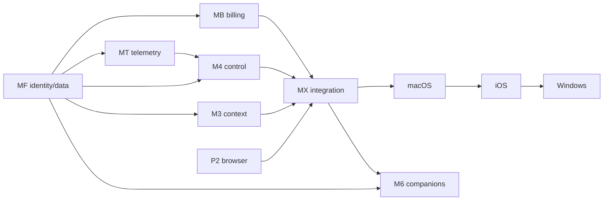

# Autonomous session-manager portfolio

Date: 2026-07-10

This compiles the remaining Moa intent portfolio after Wave 1 and the active P2
lane. Each manager owns research -> contract -> isolated implementation ->
adversarial audit -> repair. Managers do not merge, deploy, or silently invent
missing architecture; Tier 0 serially integrates only green commits.

## Evidence labels

- **Measured** means the named command or runtime exercise actually ran in a
  stated environment.
- **Architecture-confidence target** is justified by intended invariants,
  tests, canaries and constraints; it is not a benchmark result.
- No paid benchmark, external model evaluation, production traffic analysis or
  observability-vendor trial was run for this packet.

## Intent portfolio and dependency DAG

| Manager | Remaining outcome | Authoritative inputs |
|---|---|---|
| MF foundation | scoped identity, tenant isolation, retention/export/delete, projections, migrations and restore | product stack; `production-grade-hosted-product`, `remote-hosted-gateway`, `self-hostable-event-substrate` |
| MT telemetry | frontend/backend semantic telemetry, redaction, export seam, canaries, SLOs and analytics | user stack; product-stack research |
| M3 context | bounded retrieval artifacts, evaluation, privacy, interruption continuity and cache identity | goal P3; `context-thread-management` |
| M4 control plane | proposal/review/preview/claim/apply/receipt/rollback with restart-safe workers | goal P4; work-graph/hosted changes |
| MB billing | immutable usage, entitlement/budget, provider adapter, webhook and reconciliation authority | user stack; product-stack research |
| M5 native | stable Aggie protocol, then macOS, iOS and Windows native authority | goal P5; `define-aggie-compatible-surface` |
| M6 companions | signed portable manifests/assets, provenance, moderation, sharing, revocation and rollback | goal P6; companion changes |
| MX integration | compatibility matrix, serial integration and auditor-driven correctness recovery | final workflow; all packets/diffs/gates |

Launch all managers' read-only research/contract passes now. MF authority/schema
integrates first. MT envelope implementation follows MF identity/sensitivity.
M3 may develop feature-gated retrieval in parallel but integrates after MF
isolation/deletion. M4 may build pure state machines and fakes now but authority/
apply waits for MF+MT. MB may build domain fixtures and sandbox adapters now but
authoritative persistence waits for MF. M5 starts with protocol/echo; native
shells are serial macOS -> iOS -> Windows. M6 package verification can run now;
sharing waits for MF and protocol compatibility.

## Universal manager contract

Each manager receives the portfolio goal, parent instructions, this packet,
research/auditor packets, prior notes, required repo docs and relevant OpenSpecs.
It creates `goal.md`, `research/`, `contracts/`, `claims-ledger.md` and
`merge-ledger.md`; runs at least five useful read-only passes (topology, trust/
data, failure/recovery, quality/gates, and current official facts when external
dependencies are considered); uses one architecture contractor and optionally
one repair contractor; creates disjoint worktrees; and runs fresh correctness,
security, performance/resource, quality/CRAP/complexity and anti-gaming auditors.
UI work adds UX/accessibility; adjacent lanes add merge/integration audit.

Claims are `verified`, `refuted` or `unproven` with exact evidence. Mocks do not
prove live behavior; artifacts do not prove reload; deploy triggers do not prove
apply. A `BLOCK` creates a targeted repair contract in the owning lane. Green
units are committed conventionally; managers never merge or promote.

Global forbidden shortcuts: model/raw shell authority; provider secrets in
clients; model-supplied JS/CSS/eval; page/screen/user content as instruction;
unbounded context; global mutable tenant state; telemetry as product truth;
user IDs as metric labels; payment authority in model context; destructive
in-place migrations; or confidence numbers presented as benchmark scores.

## MF — identity, data and durable substrate

**Objective/non-negotiables.** Define local no-auth, remote single-user and
hosted multi-tenant semantics. Make tokens scoped, expiring, rotatable and
replay-aware. Enforce tenant scope at API and database layers. Classify content/
secrets and implement retention, export, deletion and additive, restorable
migrations.

**Ownership/lane.** Gateway auth/device identity, schema/migrations, projections,
retention/export/import/delete and blob ownership. Do not own client UX,
retrieval ranking, telemetry backend or billing provider. Branch
`agent/mf-identity-data-foundation`; worktree
`chief-moa-worktrees/mf-identity-data-foundation`; disjoint auth, schema and
lifecycle slices are permitted.

**Edges/targets.** Test cross-user ID probing, rotation/revocation, forged proxy,
concurrent rebuild, duplicate import, partial deletion, legacy migration, missing
blob and old/new binary restore. Every tenant query needs an identity predicate
and hostile two-principal test. New decision functions target complexity <=10
and CRAP <=15; exceptions need rationale. No full-table request scan; jobs are
bounded, paginated and idempotent.

**Gates/blockers/escalation.** Gateway check; strict three named OpenSpecs;
auth/device and two-principal isolation suites; projection rebuild; idempotent
export/import/delete; migration compatibility; backup plus scratch restore.
Block on global-token multi-tenancy, app-only filtering, unscoped caches/files,
destructive migration or paper-only restore. Escalate if identity provider or
retention policy is undecided, or isolation needs an unplanned staged migration.

**Model.** Most capable cross-cutting reasoning/coding model available plus a
fresh separate-context security auditor: auth+persistence+migration affects all
authority. Architecture-based recommendation, not a measured score.

## MT — telemetry, observability and product analytics

**Objective/non-negotiables.** Create a Moa-owned versioned semantic envelope,
portable export seam, frontend/backend release correlation, deterministic
canaries and consented analytics. Export failure cannot break product behavior.
Raw audio, transcripts, prompts, page/screen content, tokens, secrets and
financial details are excluded by default. High-cardinality IDs never become
metric labels. No vendor selection without dated primary-source research and a
measured isolated preview.

**Ownership/lane.** Semantic schemas, correlation, redaction/sampling/cardinality,
gateway Collector/export seam, Android/extension crash-release adapters,
canaries/SLO/alerts and analytics taxonomy. No vendor account or production SDK
rollout. `agent/mt-telemetry-foundation` in matching sibling worktree; envelope,
gateway, Android, extension and canary slices may be disjoint.

**Edges/targets.** Exporter down/slow, sampling, duplicate spans, clock skew,
offline/release mismatch, cardinality attacks, token-like malicious content and
consent deletion. Constant-bounded attributes; async bounded queues/drop counts;
no request-path export wait; stated CPU/memory/network budgets; redaction paths
target complexity <=10/CRAP <=15.

**Gates/blockers/escalation.** Golden/property redaction tests, cardinality
budgets, exporter-down fault smoke, cross-surface canary, deletion/consent test,
gateway/Android/extension gates and isolated Collector preview. Block sensitive
leaks, sync export, SDK-owned taxonomy, screenshot alert proof or vendor "best"
claims without trials. Escalate missing legal/region policy, scrubbed corpus or
paid preview authority.

**Model.** Strong architecture model for semantics/redaction; narrow SDK
executors; independent privacy/security and performance auditors; official-doc
researchers for current SDK/pricing. No benchmark claim.

## M3 — durable context retrieval

**Objective/non-negotiables.** Emit canonical bounded context artifacts with
source IDs, ranking rationale, redactions, version and cache identity. Preserve
interruption/fork continuity. Provider memory is derived, never authoritative.
Never retain/retrieve incognito, deleted, cross-tenant or unauthorized content.

**Ownership/lane.** Gateway artifact schema, retrieval/ranking, summaries/fork
inheritance, cache/invalidation, redaction and deterministic evaluation; bounded
client receipt fields after API freeze. Do not own identity or primary event
schema. `agent/m3-durable-context-retrieval` in matching sibling worktree;
artifact/evaluator, ranking, privacy/cache and client receipt slices.

**Edges/targets.** Interrupted turns, concurrent branch switch, deleted cached
source, stale summary, multilingual/empty/huge history, adversarial duplicates,
provider window shrink and offline clients. Hard item/token/byte/time bounds,
deterministic ties, indexed retrieval. Complexity <=10/CRAP <=15. Relevance,
privacy, latency and cache targets remain architecture-confidence until measured.

**Gates/blockers/escalation.** Gateway check; strict context spec; golden corpus
including deleted/incognito/adversarial cases; interruption/fork/invalidation
smokes; property bounds; stated-corpus resource benchmark. Block newest-history
stuffing, unjustified vector DB, missing identity/version cache keys or LLM judge
as truth. Escalate conflicting branch/deletion semantics or absent consented
evaluation data.

**Model.** High-capability state/retrieval implementer; narrow fixture executor;
fresh privacy, performance and anti-gaming auditors. Risk-based, not measured.

## M4 — development/deployment control plane

**Objective/non-negotiables.** Implement proposal -> review -> isolated preview
-> verification -> claim -> guarded apply -> immutable receipt -> rollback.
Models receive typed proposals, never raw shell/credentials. Workers use scoped
leases; effects are idempotent and receipted. Apply obeys preview, rollback,
drain, compatibility, backup/restore and post-smoke gates.

**Ownership/lane.** State machine, worker claims/checkpoints/dedupe, artifact
provenance, policy/receipts and deterministic adapters. No feature code or live
promotion. `agent/m4-deployment-control-plane`; disjoint state, worker, policy,
adapter and recovery slices.

**Edges/targets.** Crash after effect/before receipt, duplicate claim, lease skew,
cancel/stale approval, incompatible schema, backup/smoke/rollback failure, active
recording/job and artifact substitution. Explicit finite states; bounded queues/
retries; no orphan or duplicate effect; transition complexity <=10/CRAP <=15.

**Gates/blockers/escalation.** Gateway check; restart/resume fault suite;
duplicate-effect proof; fake preview/apply/rollback E2E; provenance, policy,
drain, restore and receipt-chain tests. Block shell strings, mutable receipts,
apply-before-preview, in-memory leases, unbounded retries or trigger-as-deploy.
Escalate if targets lack preview/rollback, authority cannot scope, or active work
cannot drain/resume.

**Model.** Most capable concurrency/state-machine model plus fresh security,
recovery and anti-gaming auditors; narrow adapters after protocol freeze.

## MB — billing, metering and entitlements

**Objective/non-negotiables.** Build meter event -> immutable usage ledger ->
versioned price -> entitlement/budget projection -> provider payment -> verified
webhook -> reconciliation. Models/clients cannot mutate payment authority.
Webhooks are signed/replay-safe/idempotent. Money is integer minor units with
currency; historical prices/usage are immutable.

**Ownership/lane.** Billing schema/domain, usage dedupe, entitlements/budgets,
adapter interface/sandbox, webhook, reconciliation/refund/dispute/grace and
audit receipts. No real charge/provider selection. `agent/mb-billing-entitlements`;
ledger, sandbox/webhook, reconciliation and entitlement slices.

**Edges/targets.** Duplicate/out-of-order events, late webhook, refunds/disputes,
currency mismatch, plan migration/trial clock, outage, correction/deletion,
concurrent spend and overflow. Serializable/idempotent transitions, paginated
reconciliation, observable lag, complexity <=10/CRAP <=15.

**Gates/blockers/escalation.** Migration compatibility; money/idempotency
properties; signed/replay fixtures; test clock; concurrent budget; outage/grace;
reconciliation/refund/dispute and two-principal tests. Block provider-as-truth,
unsigned webhook, floats, history overwrite, model mutation, leaked secrets or
duplicate charges. Escalate business model, tax geography, refund/grace policy,
provider or paid-account authority.

**Model.** Strong domain/state model plus separate financial/security auditors;
narrow fixture executor. Architecture recommendation only.

## M5 — surface protocol and native clients

**Objective/non-negotiables.** Prove the Aggie session/event/action protocol,
then ship macOS, iOS and Windows serially with native permissions, signing,
updates and receipts. Clients remain thin; local actions are validated/approved;
screen content is evidence; echo adapter precedes external backends.

**Ownership/lanes.** Aggie facade/echo/compatibility, then per-platform UI,
accessibility, permissions, secure token storage, actions and updates. Protocol
branch `agent/m5-surface-protocol`, then `agent/m5-macos-surface`,
`agent/m5-ios-surface`, `agent/m5-windows-surface` in matching worktrees.

**Edges/targets.** Reconnect/replay, duplicate turn, stale action, offline,
rotation, permission denial, sleep/wake, update rollback, N/N-1 compatibility,
interrupted voice and receipt-upload failure. Bounded buffers/backoff, no UI-
thread blocking and declared battery/network budgets; complexity <=10/CRAP <=15.

**Gates/blockers/escalation.** Strict Aggie spec; facade text/live/event and echo
smokes; N/N-1 matrix; platform build/UI/accessibility/security tests; signed
isolated update and real-device smoke. Block provider keys, direct proposal
execution, platform protocol forks, screenshots as sole proof, unsigned updates
or one OS as evidence for another. Escalate signing accounts/physical devices;
continue protocol/simulator work meanwhile.

**Model.** Strong protocol model, capable OS specialist per platform, vision
only with real render evidence, and fresh security/accessibility auditors.

## M6 — companion catalog, sharing and provenance

**Objective/non-negotiables.** Make manifests/assets portable, signed,
compatible, moderated, shareable, revocable and reversible. Companions remain
data/assets; no JS/CSS/shell. Every package has hash, provenance, license,
compatibility, signature and revocation state. Apply is previewed/versioned and
cannot mutate undeclared profile fields.

**Ownership/lane.** Manifest/signature/package, provenance/license,
compatibility, publish/install/revoke/rollback, moderation and catalog UI. No
general identity/payment/tier-C execution. `agent/m6-companion-catalog-sharing`;
crypto, backend, moderation and post-API client slices.

**Edges/targets.** Tampering, unknown signer, offline revocation, missing license,
incompatible client, collision, archive bomb, appeal, deleted publisher,
rollback after schema update and privacy leak. Bounded streaming validation,
size/count/dimension limits, content-addressed dedupe, pagination; policy paths
complexity <=10/CRAP <=15.

**Gates/blockers/escalation.** Strict companion specs; tamper/revocation,
resource fuzz, provenance completeness, compatibility, publish/install/apply/
revert, tenant/privacy and touched-surface gates. Block executable payloads,
unsigned/unlicensed artifacts, cosmetic revocation, bombs or moderation bypass.
Escalate trust root, moderation policy, accepted licenses or public authority.

**Model.** Strong security/package model, narrow UI executors, independent
supply-chain, resource, trust and UX auditors. Architecture-based only.

## MX — integration and final correctness recovery

MX owns staging, merge ledger, compatibility matrix, combined gates, isolated
previews/artifacts, promotion evidence and final claims; it writes no feature
implementation. Integration order is MF -> MT -> M3 -> M4 -> MB -> protocol ->
macOS -> iOS -> Windows -> M6 while preserving P1/P2 behavior.

Fresh whole-goal correctness, security, performance/resource, quality/CRAP/
complexity, anti-gaming, UX/accessibility and merge auditors inspect goals,
contracts, final diffs and outputs. Each `BLOCK` returns to contractors for a
targeted repair. Tier 0 reruns gateway check, extension verify/smoke, Android
build, native tests, strict OpenSpecs, migrations/restore, preview smokes and
artifact hashes. Active apply requires the complete promotion gate and receipt.

Block skipped requirements, duplicated authority, protocol/schema conflict,
stale artifacts, dirty targets, merge-only passes, unmeasured confidence as a
score, shared preview state, or unverified manager self-report. Use fresh high-
capability whole-goal auditors from independent contexts; model status is never
merge evidence.

## Required manager output

Each manager returns goal/research/contract paths; branches/worktrees/commits;
changed paths; exact commands/outcomes; measured results separated from
architecture-confidence; claims ledger; auditor verdicts/repair cycles;
artifact hashes and preview URLs; promotion proof/blocker; residual risks; and
the exact Tier 0 next action.
