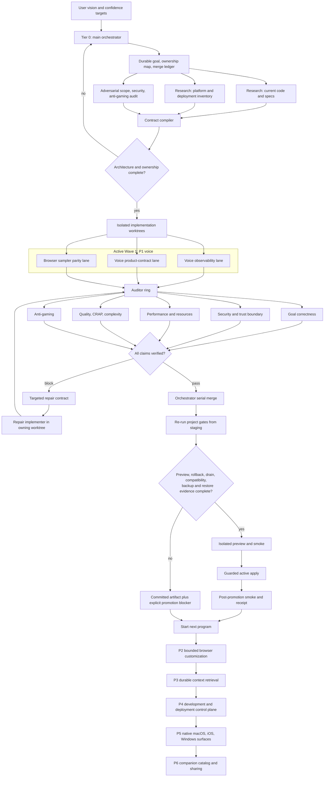

# Moa portfolio execution workflow

## Evidence rule

Measured benchmark results and architecture-confidence ratings travel on
separate paths. A mock, loopback, unit test, health response, package creation,
or deploy trigger cannot be substituted for real provider latency, audio heard,
action applied, or deployment confirmed. Every claim enters the claims ledger
and is independently verified, refuted, or left unproven.
